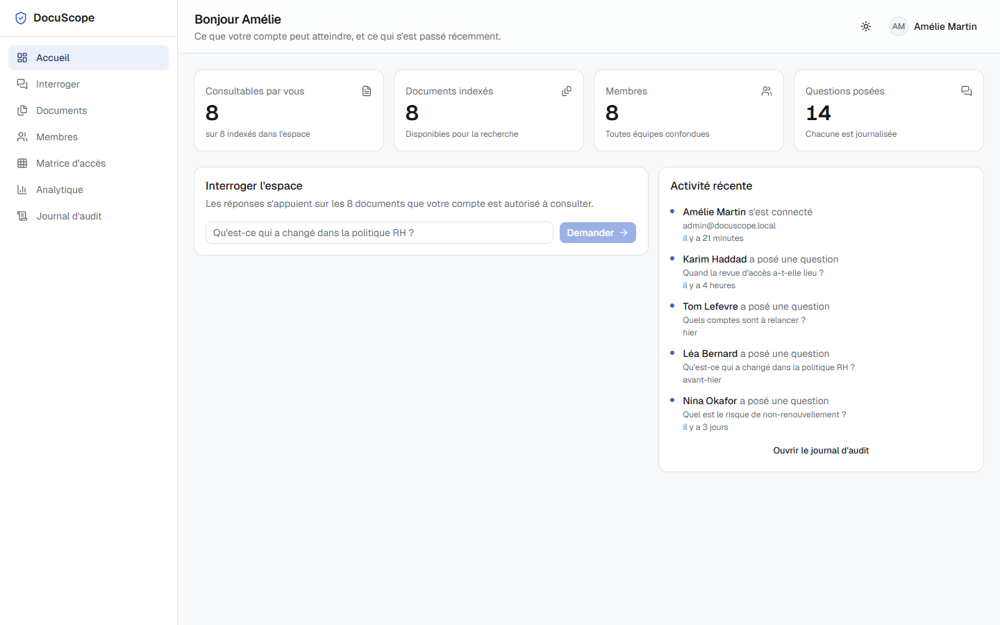
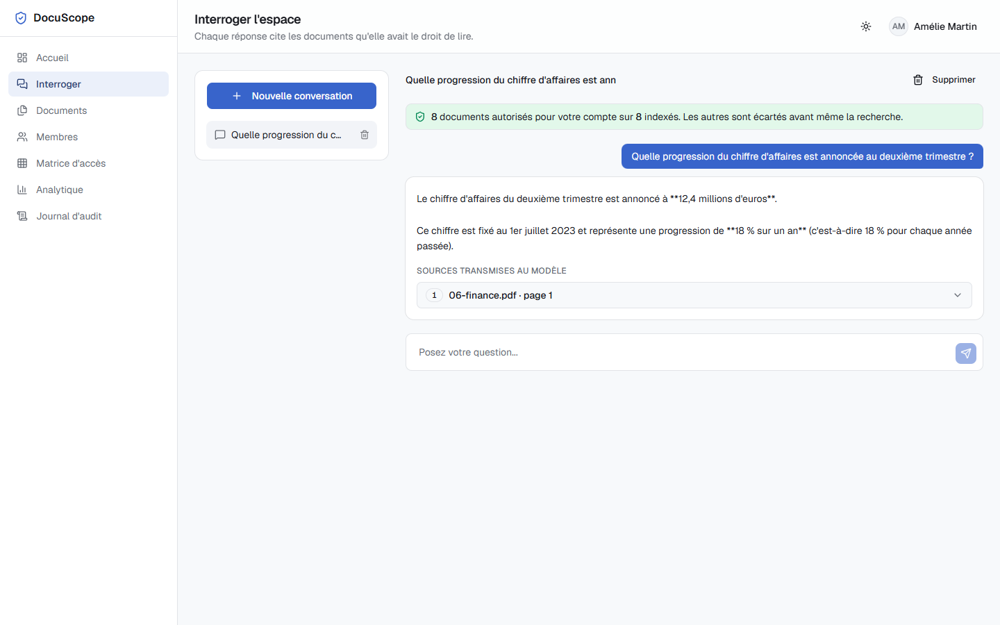
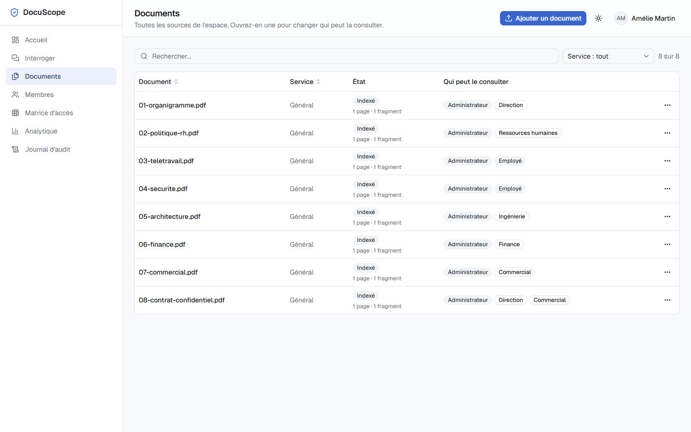
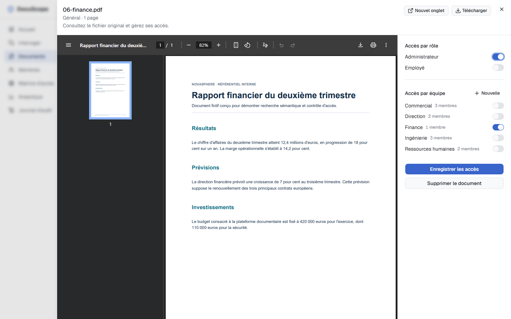
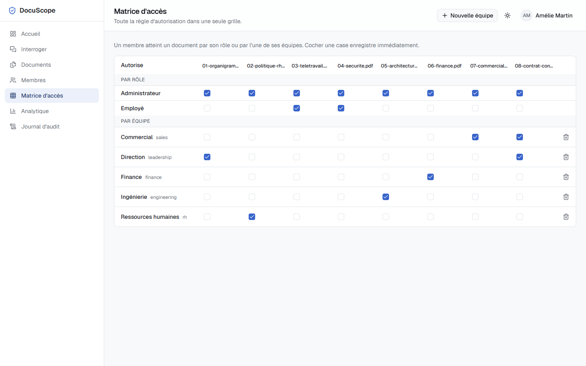
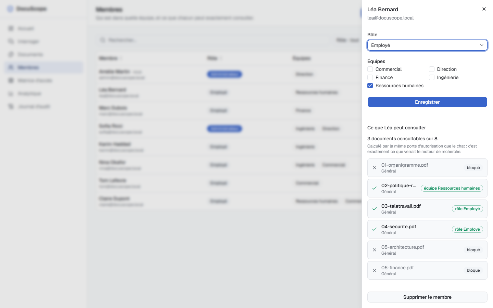
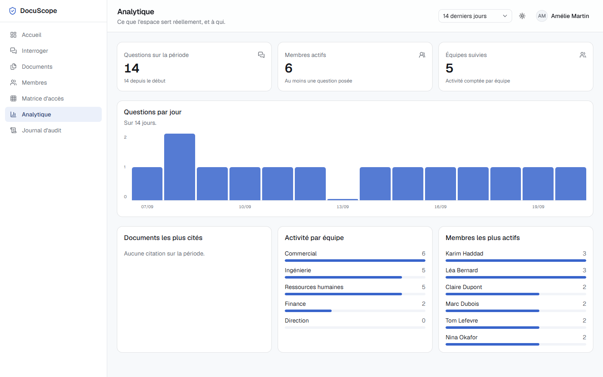

# DocuScope

[](https://github.com/Sawlyer/docuscope/actions/workflows/ci.yml)

Projet portfolio orienté ingénierie IA : RAG dense local, permissions documentaires vérifiées avant retrieval, sources consultables et stack reproductible.

RAG dense local avec contrôle d'accès par rôle et par équipe. Un administrateur dépose des documents, définit leurs permissions, puis chaque utilisateur interroge uniquement les fragments qu'il est autorisé à consulter.



## Points forts

- recherche dense multilingue avec `intfloat/multilingual-e5-small` et FastEmbed/ONNX ;
- stockage vectoriel PostgreSQL + pgvector, index HNSW et similarité cosinus ;
- filtrage des documents autorisés avant toute recherche vectorielle ;
- génération locale avec LM Studio et `minicpm5-1b` ;
- sources vérifiables : fichier, page, extrait, pertinence et accès au document original ;
- import PDF texte, TXT et Markdown depuis l'interface ;
- lecteur PDF intégré avec téléchargement et ouverture dans un nouvel onglet ;
- gestion des rôles, équipes, membres et permissions depuis l'interface ;
- conversations persistées côté serveur et strictement séparées par utilisateur ;
- authentification par cookie `HttpOnly`, validation d'origine et mots de passe Argon2 ;
- journal d'audit, tableau analytique et aperçu exact des droits d'un membre ;
- migrations Alembic automatiques et déploiement Docker Compose avec PostgreSQL local, pgvector, MinIO, FastAPI, React et Nginx ;
- jeu d'évaluation retrieval/ACL de 40 cas reproductibles.

## Ce que démontre le projet

- conception d'un pipeline RAG complet, de l'ingestion jusqu'à la réponse sourcée ;
- séparation nette entre authentification, autorisation, retrieval et génération ;
- sécurité testable : les ACL filtrent les documents avant calcul de similarité ;
- état applicatif durable : comptes, équipes, conversations, audit et documents survivent aux redémarrages ;
- démarche d'ingénierie : migrations, tests automatiques, évaluation quantitative, CI et conteneurisation ;
- produit démontrable : administration, lecteur PDF, conversations multi-utilisateur et interface responsive.

## Aperçu

### Conversation RAG avec source vérifiable

Chaque réponse affiche uniquement les sources réellement transmises au modèle.



### Gestion documentaire

La liste présente l'état d'indexation et les accès effectifs de chaque document.



### Consultation des fichiers originaux

Les PDF restent consultables depuis l'application. L'administrateur modifie les accès sans quitter le lecteur.



### Matrice d'accès

La matrice centralise les droits accordés par rôle et par équipe. Une modification est enregistrée immédiatement.



### Vérification des droits d'un membre

L'aperçu explique, document par document, pourquoi l'accès est accordé ou refusé.



### Suivi analytique



## Fonctionnement du RAG

1. L'API reçoit un PDF, un fichier TXT ou Markdown.
2. PyMuPDF extrait le texte page par page.
3. Le texte est découpé en fragments de 1 000 caractères maximum avec 150 caractères de chevauchement, sans mélange entre pages.
4. FastEmbed encode les fragments avec le préfixe E5 `passage:` et les questions avec `query:`.
5. MinIO conserve le fichier original. PostgreSQL conserve métadonnées, fragments, permissions et vecteurs de dimension 384.
6. Pour une question, l'API calcule d'abord la liste des documents autorisés pour l'utilisateur.
7. La requête pgvector applique cette liste avant le classement par similarité cosinus.
8. Seuls les cinq meilleurs fragments dépassant le seuil calibré `0.70` peuvent entrer dans le contexte, limité à 7 000 caractères.
9. LM Studio génère la réponse. Les sources retenues restent consultables dans l'interface.

## Frontière de sécurité

L'autorisation précède la recherche :

```text
Utilisateur authentifié
        │
        ▼
Rôles et équipes autorisés
        │
        ▼
Filtre SQL sur les identifiants de documents
        │
        ▼
Recherche vectorielle pgvector
        │
        ▼
Contexte transmis à LM Studio
```

Un fragment interdit ne participe jamais au classement et ne peut jamais atteindre le modèle, même si la question cite son titre ou son contenu. Les endpoints de lecture des fichiers appliquent la même règle et renvoient `403` lorsque l'accès manque.

## Démarrage local

### Prérequis

- Docker Desktop ;
- LM Studio ;
- modèle `minicpm5-1b` chargé dans LM Studio ;
- serveur LM Studio actif sur `http://localhost:1234`.

L'API attend le format LM Studio suivant :

```bash
curl http://localhost:1234/api/v1/chat \
  -H "Content-Type: application/json" \
  -d '{
    "model": "minicpm5-1b",
    "system_prompt": "Réponds en français.",
    "input": "Bonjour"
  }'
```

Lancez ensuite l'ensemble de la stack :

```powershell
docker compose up --build
```

Services :

| Service | Adresse |
|---|---|
| Interface | http://localhost:18000 |
| API FastAPI | http://localhost:18080 |
| PostgreSQL | `localhost:15432` |
| MinIO | `localhost:19000` |
| Console MinIO | http://localhost:19001 |

Le premier démarrage applique les migrations PostgreSQL, initialise les données de démonstration puis télécharge le modèle d'embeddings dans le volume Docker `model_cache`. Les démarrages suivants réutilisent données et cache. Copiez [`.env.example`](.env.example) vers `.env` pour modifier les ports.

## Comptes de démonstration

| Adresse | Mot de passe | Accès principal |
|---|---|---|
| `admin@docuscope.local` | `Admin123!` | Administration complète |
| `lea@docuscope.local` | `Demo123!` | Ressources humaines |
| `marc@docuscope.local` | `Demo123!` | Finance |

Comptes, équipes, audit et conversations sont stockés dans PostgreSQL. Une conversation créée par Amélie reste invisible pour Marc ou Léa, y compris après redémarrage.

## Corpus de démonstration

Huit PDF fictifs sont disponibles dans [`demo-corpus/pdfs`](demo-corpus/pdfs) :

| Document | Accès configuré |
|---|---|
| `01-organigramme.pdf` | Direction |
| `02-politique-rh.pdf` | Ressources humaines |
| `03-teletravail.pdf` | Tous les employés |
| `04-securite.pdf` | Tous les employés |
| `05-architecture.pdf` | Ingénierie |
| `06-finance.pdf` | Finance |
| `07-commercial.pdf` | Commercial |
| `08-contrat-confidentiel.pdf` | Direction et Commercial |

Les sources Markdown ayant servi à créer ces fichiers restent disponibles dans [`demo-corpus/sources`](demo-corpus/sources).

## Scénarios à tester

1. Connecté comme administrateur : `Qui dirige l'entreprise et depuis quand ?`
   Réponse attendue : Amélie Martin, janvier 2024, avec `01-organigramme.pdf` comme source.
2. Connecté comme administrateur ou Marc : `Quelle progression du chiffre d'affaires est annoncée au deuxième trimestre ?`
   Réponse attendue : 18 %, avec `06-finance.pdf` comme source.
3. Connecté comme Léa, poser la même question financière.
   Résultat attendu : information introuvable et aucune source transmise.
4. Poser une question hors corpus : `Quelle est la capitale du Japon ?`
   Résultat attendu : aucun contexte documentaire transmis au modèle.
5. Créer une conversation avec Amélie, se déconnecter puis ouvrir Marc.
   Résultat attendu : la conversation d'Amélie reste invisible pour Marc.
6. Ouvrir un document depuis une source, puis tester le même fichier avec un compte non autorisé.
   Résultat attendu : lecture pour le compte autorisé, réponse HTTP `403` pour l'autre.

## Architecture

```text
React + TypeScript
        │ HTTP + cookie HttpOnly
        ▼
FastAPI ───────────────► LM Studio / minicpm5-1b
   │
   ├── PostgreSQL + pgvector : documents, fragments, vecteurs, permissions
   ├── MinIO : fichiers originaux
   └── FastEmbed / E5 : embeddings locaux
```

Documents, fragments, vecteurs, permissions, comptes, équipes, événements d'audit et conversations persistent après redémarrage dans PostgreSQL. Les fichiers originaux persistent dans MinIO. Alembic versionne le schéma.

## Tests

Backend :

```powershell
docker compose exec -T -w /app api python -m pytest -q
```

Frontend :

```powershell
cd frontend
npm test
npm run lint
npm run build
```

Évaluation du retrieval dense et de la frontière ACL :

```powershell
docker compose exec -T api python -m app.eval_cli --cases /evaluation/cases.jsonl
```

Le rapport affiche `recall_at_k`, `mrr` et `acl_leakage_count`. Toute fuite ACL provoque un code de sortie non nul. Le corpus d'évaluation est versionné dans [`evaluation/cases.jsonl`](evaluation/cases.jsonl).

Baseline locale actuelle : Recall@K `1.0`, MRR `0.725`, fuite ACL `0` sur 40 cas. Résultat complet dans [`evaluation/baseline.json`](evaluation/baseline.json).

Contrôle facultatif de la matrice à 1440 px avec `playwright-cli` :

```powershell
playwright-cli -s=docuscope-ui open http://localhost:18000/acces
playwright-cli -s=docuscope-ui run-code --filename=frontend/tests/access-layout.playwright.js
playwright-cli -s=docuscope-ui close
```

La suite couvre notamment migrations, persistance, cookies de session, validation d'origine, extraction PDF, refus explicite des PDF sans texte, découpage, préfixes E5, seuil de pertinence, filtrage ACL avant recherche, isolation documentaire, compensation MinIO, gestion des équipes, conversations serveur et métriques d'évaluation.

## Limites connues

- OCR non inclus : un PDF image sans couche texte est refusé explicitement.
- Pas de reranker, recherche hybride, OCR, observabilité, streaming ni SSO.
- `minicpm5-1b` est volontairement compact ; les sources restent affichées pour permettre la vérification.
- Secrets et comptes fournis uniquement pour environnement local de démonstration.

## Licence

MIT. Corpus entièrement fictif, sans donnée d'entreprise réelle.
